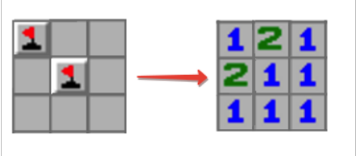

# Ejercicio Buscaminas (JAVA)

## Pregunta Técnica:

En el popular juego Buscaminas, se tiene un tablero con algunas minas y las celdas que no contienen una mina tienen un número que indica el número total de minas en las celdas vecinas. Comenzando con un arreglo de minas, queremos crear una configuración de juego Buscaminas.

Implemente el código necesario que permita obtener una configuración .

##### Ejemplo:

Para:

- matriz = [[true, false, false],
          [false, true, false],
          [false, false, false]]

La salida debe ser:

- buscaminas(matriz) = [[1, 2, 1],
                       [2, 1, 1],
                       [1, 1, 1]]

Matriz rectangular del mismo tamaño que la matriz (N), cada celda de la cual contiene un número entero igual al número de minas en las celdas vecinas. Dos celdas se denominan vecinas si comparten al menos una esquina. 

#### Entradas sugeridas y Salidas esperadas:

En la plantilla (repositorio), la función "main(String[] args)" espera recibir parámetros de entrada con el siguiente formato:

- "tamaño matriz (N)" "datos fila 1" "datos fila 2" ... "datos fila N"
- Ejemplo: "3" "true,false,false" "false,true,false" "false,false,false"
- El primer parámetro "tamaño matriz (N)" está siendo alojado en la variable 'boardSize'
- Los demás parámetros "datos de las filas" son leídos y agregados a las lista 'rowConfiguration' a través de la función '**readConfigurationData**'. Puede implementar su propia versión si lo considera pertinente.

Y se espera como resultado la configuración obtenida sea asignada a la variable 'initialBoard' que es una matriz de NxN, cuya presentación está a cargo de la función 'showInitialBoard' y que muestra lo siguiente:

- The Minesweeper configuration is: [config. fila 1],[config. fila 2], ... ,[cofig. fila N]
- Ejemplo: The Minesweeper configuration is: [1,2,1],[2,1,1],[1,1,1]
- Está implementada la función '**showInitialBoard**' que imprime la matriz con el resultado obtenido. Esta función NO se debe borrar: su implementación ni su invocación.

**CONSIDERAR:** Sabemos de la existencia de respuestas en internet para esta pregunta, pero deseamos conocer su capacidad analítica para la resolución de este problema. Esperamos que el candidato tenga buenas habilidades en desarrollo de algoritmos para que pueda trabajar con equipo técnico apropiadamente.
